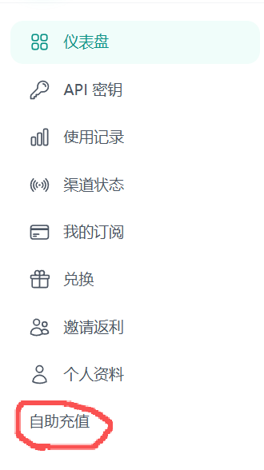
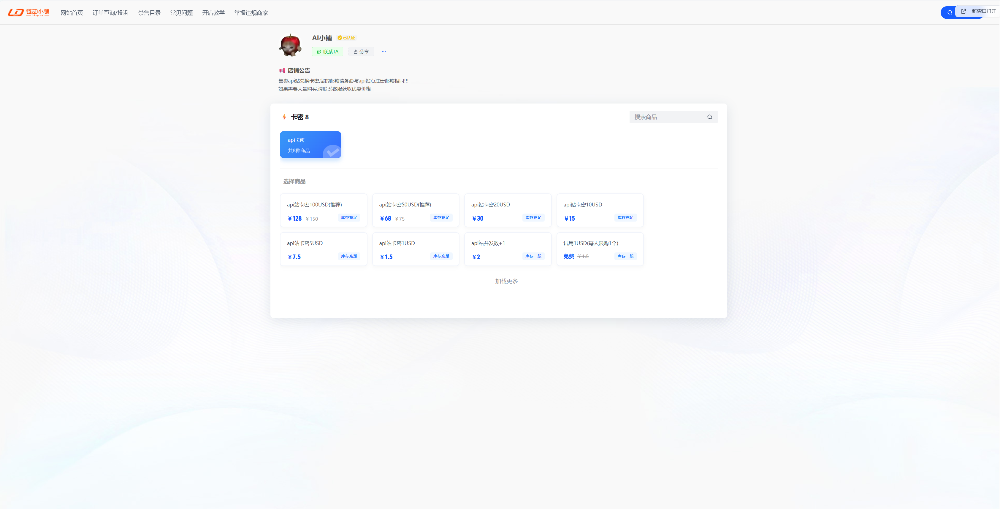
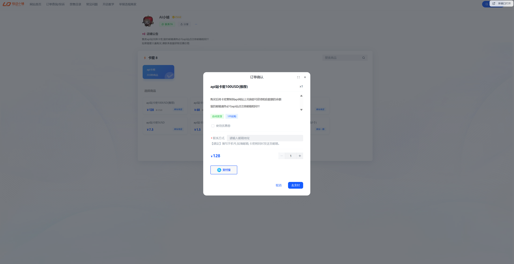
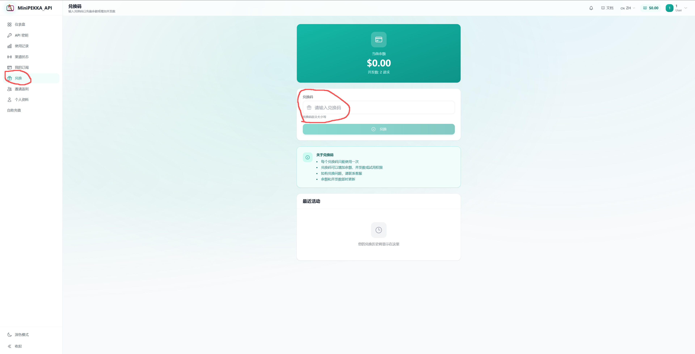
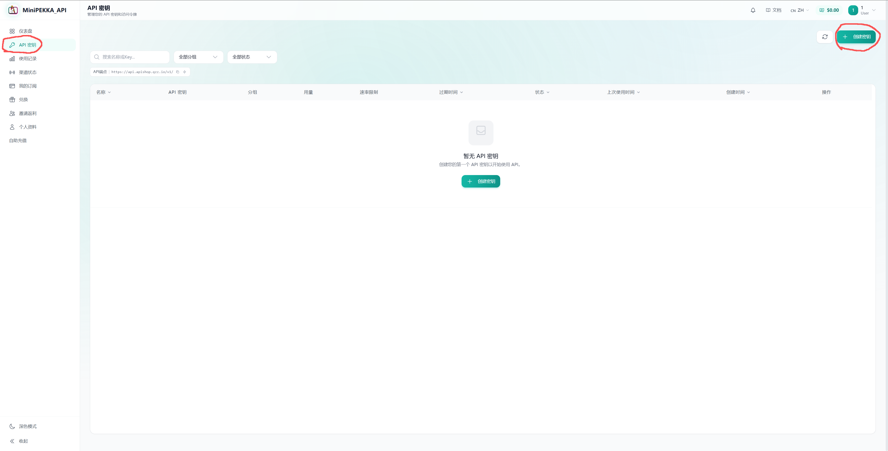
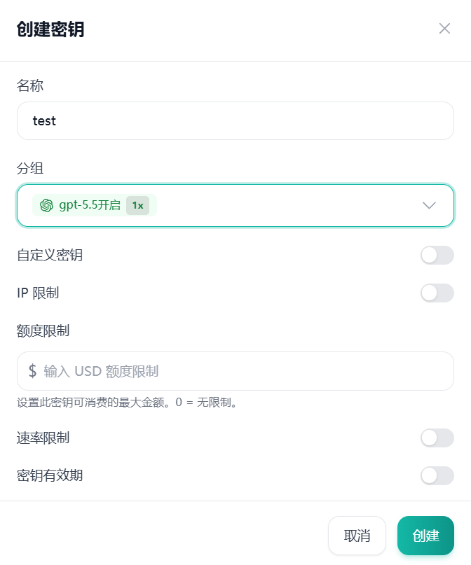
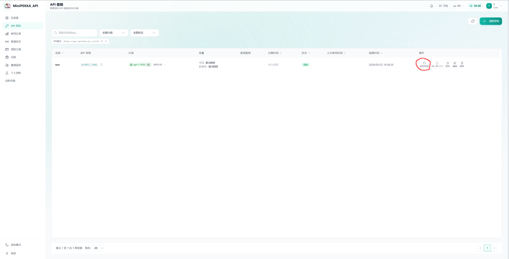
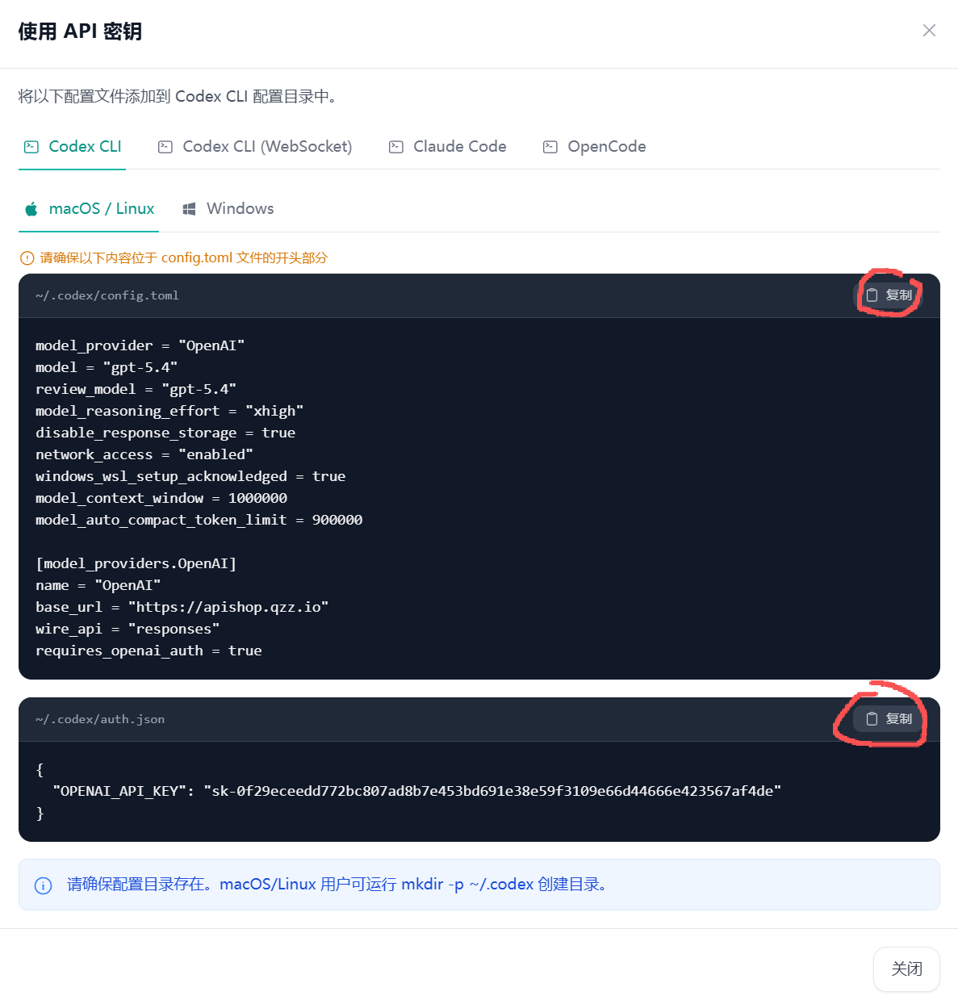
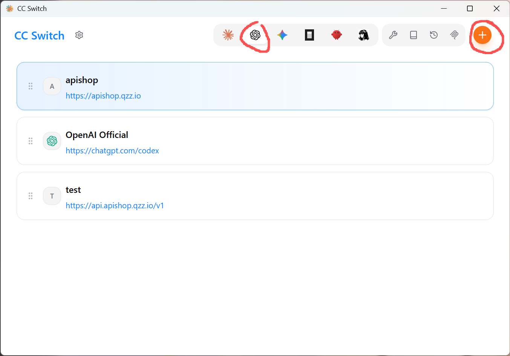
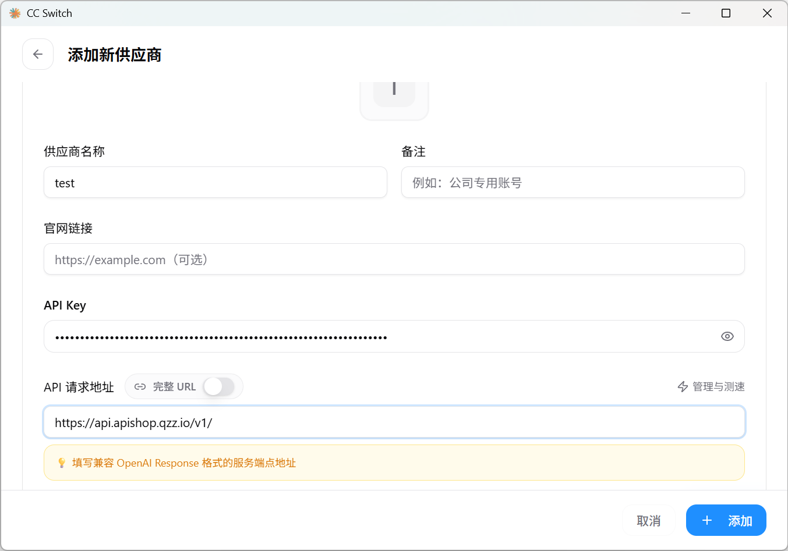

# 使用说明

## 如何充值

点击侧边栏自助充值按钮即可打开商店页面

如遇到网页加载失败请点击在新窗口打开
选择好套餐及数量后,填写与注册时相同的邮箱并完成购买

购买后在侧边栏兑换处进行卡密兑换即可获得余额

## 如何使用密钥

### 1.生成新密钥

点击侧边栏API密钥并点击创建密钥

设置好名称和分组后点击创建即可完成创建密钥

### 2.在codex中使用密钥
首先打开~/.codex目录,找到config.toml与auth.json两个文件,在API密钥界面点击使用密钥

选择好自己的客户端后将两个文件内容复制进去,再重新打开codex CLI工具或者VS Code插件即可

### 3.在CC Switch中导入密钥

打开CC Switch后选择OPENAI并点击右上角加号,选择自定义配置

填入你的APIKEY以及API请求地址(可以在API密钥界面复制)
点击添加后保存即可正常使用